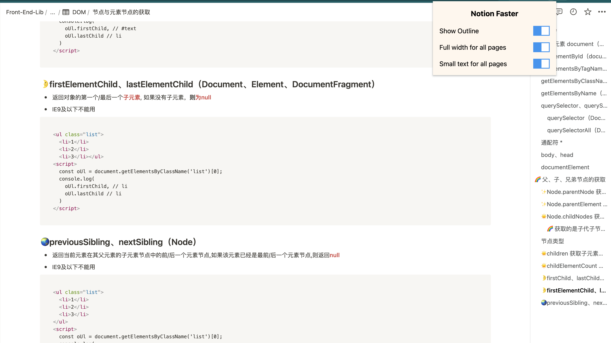

# NOTION FASTER

    <h1>Notion Faster</h1>
    A chrome extension to improve the efficiency of the notion web app

## Installation
**Click the image** below to install (soon later):

Please rate it on [chrome web store](https://chrome.google.com/webstore/detail/jaklejjegklojefgmimdllbkhhkjfald/) or star it on github if you like it. Your encouragement will help me make it better, thanks!

Manual Installation

1. Download [notion-faster.zip](https://github.com/evestorm/notion-faster/releases/latest).
2. Unzip it and move it to the safe path(you won't delete it accidentally).
3. Go to `chrome://extensions/`
4. Open `Developer mode`.
5. Drag the folder to chrome or Click `Load unpacked` and select the folder.

## Features

- [x] Show Outline
- [x] Full width for all pages
- [x] Small text for all pages

## Shortcuts

- `CTRL/CMD + Shift + O`: Show or hide the outline.
- `CTRL/CMD + Shift + K`: Set full width for all pages by default.
- `CTRL/CMD + Shift + Z`: Set small text for all pages by default.

## LICENSE

[AGPL-3.0](./LICENSE)